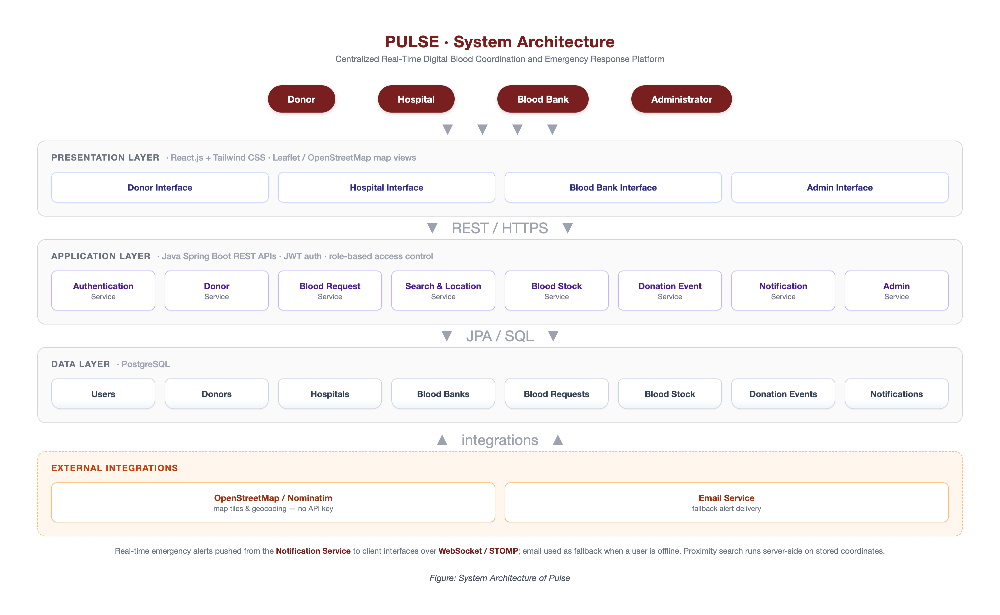
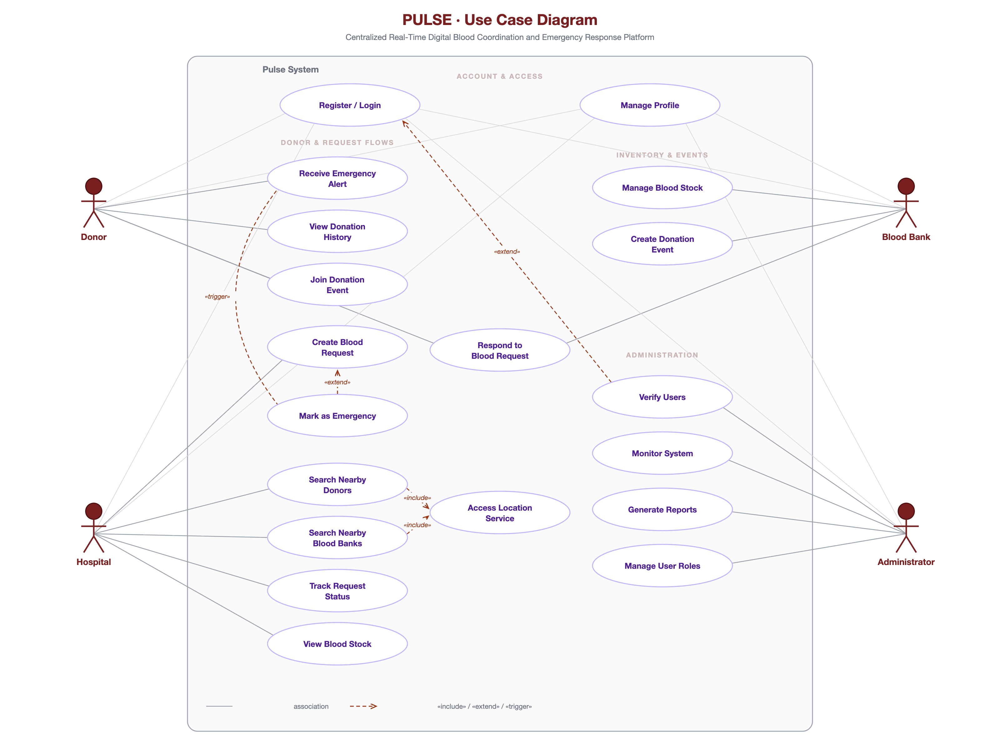

# Project Proposal  
## Pulse  
### A Centralized Real-Time Digital Blood Coordination and Emergency Response Platform

**By:** Asal Paudel  
**School:** School of Science and Technology  
**University:** Asia e University  
**Date:** 7th March, 2026  

---

# CPP400 Project Proposal  
## Enterprise Networking

**By:** Asal Paudel  
**Student ID:** C30109220115  
**Program:** Bachelor of Information & Communication Technology  
**School:** School of Science and Technology  
**University:** Asia e University  
**Semester:** 7th Semester  

---

# Disclaimer

I am accountable for the truthfulness of every point of view, technical remark, factual account, statistic, figure, illustration, and picture used in this report. I am solely responsible for ensuring that any copyright or ownership restrictions have been checked in the submitted report.

Asia e University expressly disclaims all liability for the accuracy of any opinion, report, technological data, factual data, ownership claim, or copyright claim.

**Asal Paudel**  
**C30109220117**

---

# Acknowledgement

I would like to express my sincere gratitude to my project supervisor, faculty members, and academic department for their continuous support, valuable suggestions, and guidance throughout the preparation of this project proposal. Their encouragement and academic insights have been instrumental in shaping the direction of this work.

I am also thankful to my friends, classmates, and family members for their motivation and support during this process. Finally, I extend my appreciation to all the researchers, institutions, and digital platforms whose studies and systems provided the background knowledge required for this proposal.

---

# Abstract

Blood availability is one of the most critical elements of an effective healthcare system, especially during emergencies such as accidents, surgeries, maternal complications, disaster response, and trauma care. In Nepal and other developing countries, blood coordination remains fragmented due to the lack of a centralized digital platform connecting donors, blood banks, hospitals, and emergency responders in real time.

Existing systems mainly focus on donor registration and basic search features, but they offer limited emergency alerting, weak institutional integration, outdated user experience, and insufficient support for coordinated blood management workflows.

This project proposes **Pulse**, a centralized real-time digital blood coordination and emergency response platform designed to improve the speed, reliability, and efficiency of blood access in Nepal. The proposed system will allow donors to register and manage profiles, hospitals and blood banks to maintain availability records, and emergency cases to trigger real-time blood requests and alerts.

The platform will also support routine donation event coordination, location-based donor and blood bank search, and verified information handling to improve trust and operational effectiveness. These proposed features directly respond to the gaps identified in the literature review and comparative analysis.

The proposed system will be developed using **Java Spring Boot** for the backend, **React.js** for the frontend, and **MySQL** for database management, with support for real-time notifications and **Google Maps API** for proximity-based search.

The project is expected to be technically feasible, operationally practical, and socially significant, as it addresses an urgent healthcare coordination problem using an accessible and scalable web-based solution.

**Keywords:** blood donation, emergency response, blood bank management, real-time coordination, healthcare information system, web application

---

# Table of Contents

- Disclaimer  
- Acknowledgement  
- Abstract  
- List of Tables  
- List of Figures  
- List of Abbreviations  
- Chapter 1: Introduction  
  - 1.1 Overview  
  - 1.2 Problem Statement  
  - 1.3 Objectives of the Project  
  - 1.4 Scope  
  - 1.5 Justifications and Significance of the Study  
- Chapter 2: Literature Review  
  - 2.1 Introduction  
  - 2.2 Related Concepts for the Proposed Platform  
  - 2.3 Review of Existing System  
  - 2.4 Gaps in Existing System  
  - 2.5 Technology Insights from Literature  
  - 2.6 Proposed System Overview  
  - 2.7 Conclusion  
- Chapter 3: Methodology  
  - 3.1 Introduction  
  - 3.2 Data Collection Technique  
  - 3.3 User Requirements  
  - 3.4 Feasibility Study  
  - 3.5 Project Development Approach  
  - 3.6 Tools, Frameworks, Languages & Technologies Used  
  - 3.7 System Architecture Overview  
  - 3.8 User Roles and System Capabilities  
  - 3.9 High-Level Diagrams  
- Chapter 4: Project Timeline  
- Chapter 5: Conclusion  
- References  

---

# List of Tables

| Table No. | Title |
|---|---|
| Table 2-1 | Feature Comparison Matrix |
| Table 3-1 | Technology Stack |

---

# List of Figures

| Figure No. | Title |
|---|---|
| Figure 1 | Landing Page of Nepali Blood Donors’ Website |
| Figure 2 | Landing Page of Nepal Blood |
| Figure 3 | American Red Cross Blood Donor App |
| Figure 4 | System Architecture of Pulse |
| Figure 5 | Use Case Diagram |
| Figure 6 | Proposed Timeline Phase 1 |
| Figure 7 | Proposed Timeline Phase 2 |

---

# List of Abbreviations

| Term | Full Form |
|---|---|
| API | Application Programming Interface |
| FYP | Final Year Project |
| GPS | Global Positioning System |
| MVP | Minimum Viable Product |
| UI | User Interface |
| UX | User Experience |

---

# Chapter 1: Introduction

## 1.1 Overview

Blood is a life-saving medical resource required for surgeries, trauma care, maternal emergencies, cancer treatment, and other critical health interventions. The timely availability of safe blood can significantly reduce mortality and improve clinical outcomes.

However, the process of blood procurement in many developing countries remains inefficient due to fragmented donor databases, delayed communication, and weak coordination among healthcare stakeholders. The literature review frames this as a core systems problem rather than only an awareness problem.

Nepal has seen the emergence of digital blood donation platforms such as **Nepali Blood Donors** and **Nepal Blood**, which help users search for donors and post donation requests. However, these systems remain limited in scope. They provide donor-focused services but do not sufficiently support direct hospital and blood bank integration, donor availability tracking, real-time alerting, or coordinated workflows across emergency response teams.

To address these issues, this project proposes **Pulse**, a real-time digital blood coordination platform that connects donors, hospitals, blood banks, and emergency responders through a centralized system. Pulse aims to improve blood accessibility, emergency responsiveness, trust in data, and operational coordination while also supporting routine blood donation programs and events.

---

## 1.2 Problem Statement

Access to blood during emergencies is often delayed due to fragmented communication and poor institutional coordination. Existing blood donation platforms in Nepal primarily focus on donor listing and simple request posting, but they do not provide a unified, real-time operational system linking blood donors, hospitals, blood banks, and emergency service actors.

This creates delays, dependency on manual communication, poor data reliability, and reduced efficiency in critical situations.

The literature review identifies several specific gaps in current solutions:

- No unified multi-stakeholder platform
- Limited or absent emergency alert mechanisms
- Weak inventory integration with hospitals and blood banks
- Poor support for emergency coordination alongside scheduled donation events

Therefore, the main problem addressed by this project is the absence of a centralized real-time blood coordination system capable of managing emergency requests, donor matching, institutional integration, and routine blood donation workflows in a reliable and scalable manner.

---

## 1.3 Objectives of the Project

The main objective of this project is to design and develop **Pulse**, a centralized real-time blood coordination and emergency response platform for Nepal.

The specific objectives are:

- To develop a centralized digital platform connecting blood donors, hospitals, blood banks, and emergency response stakeholders.
- To implement real-time emergency blood request and alert mechanisms for faster response and coordination.
- To enable location-based donor and blood bank search using mapping services.
- To integrate hospital and blood bank blood availability records into the system.
- To support both emergency blood requests and regular blood donation event management.
- To provide secure user registration, profile management, and verified data handling for trust and reliability.
- To develop the system using a scalable modern web stack consisting of Spring Boot, React.js, and MySQL.

---

## 1.4 Scope

The scope of Pulse includes the design and development of a web-based platform with multiple user roles.

The major stakeholders of the system are:

- Blood donors
- Hospitals
- Blood banks
- System administrator
- Emergency request initiators/coordinators

The platform will support:

- User registration and login
- Donor profile creation and blood group management
- Emergency blood request posting
- Real-time notifications and alerts
- Location-based search for nearby donors and blood banks
- Hospital and blood bank blood stock visibility
- Donation history and request management
- Management of regular blood donation events
- Admin management and verification control

The system will focus on digital coordination and information management. It will not include full medical diagnosis, direct transfusion management, or ambulance dispatch execution in the initial phase.

---

## 1.5 Justifications and Significance of the Study

### 1.5.1 Practical Significance

This project addresses a real and socially important healthcare coordination gap. During emergencies, delays in accessing blood can directly affect patient survival.

A centralized real-time system like Pulse can improve operational speed, reduce dependency on informal communication channels, and strengthen access to verified donor and inventory information.

---

### 1.5.2 Academic Significance

From an academic perspective, this project contributes to the design of digital health coordination systems in developing-country contexts.

It demonstrates how software engineering, database systems, web technologies, and real-time communication features can be applied to solve a public health logistics problem.

---

### 1.5.3 Social Significance

Pulse has the potential to improve emergency preparedness, strengthen trust in digital donor coordination, support healthcare institutions, and encourage a more organized culture of voluntary blood donation.

It moves beyond donor awareness and addresses operational coordination, which is the larger market gap identified in the review.

---

# Chapter 2: Literature Review

## 2.1 Introduction

Blood availability is a critical component of modern healthcare systems, particularly during emergencies such as trauma, surgical procedures, maternal complications, and disaster response.

Timely access to safe blood can significantly reduce mortality and improve patient outcomes. Despite medical advancements, many developing countries continue to experience challenges related to fragmented blood donor information, delayed coordination, and limited real-time communication among blood banks, hospitals, and emergency responders.

Recent advancements in digital health systems have introduced online platforms and mobile applications to improve donor management and blood accessibility. This literature review examines existing blood donation and coordination platforms, highlighting their features, limitations, and relevance to the proposed Pulse system.

---

## 2.2 Related Concepts for the Proposed Platform

### 2.2.1 Centralized Blood Information System

Centralized blood information systems maintain unified databases containing donor records, blood group availability, collection dates, and expiry information across multiple blood banks.

According to the World Health Organization, centralized systems improve transparency, reduce duplication, and minimize blood wastage by enabling redistribution between facilities.

Such systems are particularly effective in urban healthcare networks where inter-hospital coordination is essential.

---

### 2.2.2 Emergency Response and Real-Time Communication

Emergency healthcare delivery relies heavily on real-time communication and coordination.

Studies indicate that delays in blood procurement are a major contributor to preventable deaths in trauma and emergency cases. Digital platforms offering instant notifications, alerts, and request broadcasting can significantly reduce response times and improve emergency preparedness.

---

### 2.2.3 Donor Mechanism and Trust Mechanisms

Effective blood donation systems require robust donor management mechanisms, including:

- Donor verification
- Eligibility tracking
- Donation history management
- Privacy protection

Trust and transparency are critical factors influencing donor participation and retention. Digital systems that provide clear information, reminders, and secure data handling are more likely to sustain long-term donor engagement.

---

### 2.2.4 Digital Health Platforms in Developing Countries

In developing countries, digital health platforms must address infrastructural limitations, varying levels of digital literacy, and local regulatory requirements.

Research suggests that mobile-first and locally contextualized platforms are more effective than generic international solutions in such environments.

---

## 2.3 Review of Existing System

### 2.3.1 Nepali Blood Donors

Nepali Blood Donors is a web- and mobile-based blood donation platform developed to address blood accessibility challenges in Nepal.

The system functions as a centralized repository of blood donors, blood banks, and ambulance services. Users are able to search for donors based on blood group and geographic location, post emergency blood requests, and access auxiliary services such as ambulance contact information and digital donor cards.

The platform aims to facilitate faster responses during emergencies by connecting patients, donors, and healthcare service providers across the country.

#### Issues and Limitations

- Limited integration with hospital and blood bank inventory systems
- No appointment scheduling or donor availability tracking features
- User interface is relatively outdated and not highly intuitive
- Mobile application availability is limited to Android devices only

---

### 2.3.2 Nepal Blood

Nepal Blood is an online blood donation service established with a non-profit objective to promote voluntary blood donation across Nepal.

The platform allows users to register as blood donors and search for required blood types based on blood group and geographic area. In addition to donor matching, the system provides educational information highlighting the importance of blood donation and its role in saving lives.

The primary focus of Nepal Blood is community awareness and social responsibility rather than structured institutional or emergency coordination.

#### Issues and Limitations

- Absence of real-time emergency coordination and alert mechanisms
- Outdated and less user-friendly user interface
- No direct integration with hospitals or blood banks
- Mobile application support is limited to Android devices only

---

### 2.3.3 Red Cross Blood Donor App

The Red Cross Blood Donor App, developed by the American Red Cross, is a comprehensive digital platform designed to enhance the blood donation experience.

The application enables users to schedule and manage donation appointments, track donation history, access digital donor cards, and locate nearby blood drives.

The app emphasizes donor engagement, operational efficiency, and long-term participation rather than emergency blood matching.

#### Issues and Limitations

- Focused on planned donations rather than emergency response
- Not designed for developing country healthcare contexts
- Limited interoperability with external emergency systems

---

## 2.4 Gaps in Existing System

### 2.4.1 Feature Comparison Matrix

| Feature | Nepali Blood Donors | Nepal Blood | Red Cross App | Pulse Proposed |
|---|---|---|---|---|
| Donor Search | Yes | Yes | Yes | Yes |
| Emergency Request Support | Yes | No | No | Yes |
| Direct Hospital & Blood Bank Integration | No | No | Partial | Yes |
| Regular Blood Donation Event Management | No | No | Yes | Yes |

---

### 2.4.2 Identified Market Gaps

The following gaps were identified from the comparison of existing systems:

- No unified platform connecting blood donors, hospitals, blood banks, and emergency response teams.
- Limited or no real-time emergency blood request and alert mechanisms.
- Absence of direct hospital and blood bank inventory integration.
- Poor support for coordinating emergency cases alongside regular blood donation events.
- Lack of centralized and verified data, leading to delays and dependency on manual communication.
- Limited scalability and interoperability across healthcare institutions.

---

## 2.5 Technology Insights from Literature

The literature review indicates that an effective digital blood coordination system should be built on a centralized database, real-time communication capability, and a user-friendly interface that supports multiple stakeholders.

Existing studies and platform comparisons show that current systems are limited by weak institutional integration, lack of emergency alert features, and poor scalability, especially in developing-country contexts.

These findings suggest that the proposed Pulse system should use a modern and scalable technology stack such as:

- Spring Boot for backend services
- React.js for a responsive frontend
- MySQL for structured data management
- Google Maps API for location-based search
- Notification services for real-time coordination

---

## 2.6 Proposed System Overview

Based on the gaps identified in existing blood donation platforms, Pulse is proposed as a centralized, real-time digital blood coordination platform that connects donors, hospitals, blood banks, and emergency response stakeholders in a single system.

The system is designed to support:

- Donor registration
- Emergency blood request handling
- Blood stock visibility
- Location-based donor and blood bank search
- Real-time notifications
- Regular donation event management

Unlike existing systems that mainly focus on donor listing or awareness, Pulse aims to provide broader operational coordination and institutional integration.

---

## 2.7 Conclusion

The literature review shows that although existing blood donation systems provide useful services such as donor registration and basic search, they do not fully address the need for real-time coordination, institutional integration, and comprehensive blood management in Nepal.

The identified gaps clearly justify the development of Pulse as a centralized, scalable, and locally relevant platform capable of improving emergency blood access, streamlining communication among stakeholders, and supporting both urgent and routine blood donation activities more effectively.

---

# Chapter 3: Methodology

## 3.1 Introduction

This chapter outlines the system analysis and planning involved in the development of a real-time digital blood coordination and emergency response platform.

It covers:

- Data collection approach
- Development methodology
- Technology stack
- System architecture
- User requirements

The analysis ensures that the proposed solution is both relevant to stakeholder needs and achievable within the available technological and temporal resources.

---

## 3.2 Data Collection Technique

To identify system requirements and validate the scope of the proposed project, a multi-method data collection approach was employed.

Primary data was collected through interactions with healthcare personnel working in local hospitals, including doctors, nurses, and supporting medical staff. These stakeholders provided practical insights into:

- Blood request handling challenges
- Emergency coordination issues
- Dependence on manual communication
- Absence of real-time blood inventory visibility

Additional expert consultation was conducted with professionals at Shubhu Tech, a technology outsourcing firm specializing in scalable web applications and real-time systems.

Secondary data was gathered through a systematic review of existing blood donation and coordination platforms such as:

- Nepali Blood Donors
- Nepal Blood
- Red Cross Blood Donor App

Relevant literature on centralized blood information systems, emergency healthcare coordination, donor management, and digital health platforms in developing countries was also reviewed.

---

## 3.3 User Requirements

Based on stakeholder interactions and literature analysis, the user requirements for Pulse were identified across four primary user groups:

### Hospital Users

Hospital users require the ability to:

- Create emergency and non-emergency blood requests
- Access real-time blood inventory information
- Track request status
- Coordinate efficiently with blood banks during critical situations

### Blood Bank Users

Blood bank users require features for:

- Managing blood stock by blood group
- Responding to hospital requests
- Organizing regular donation campaigns
- Maintaining secure institutional access

### Donor Users

Donor users require the ability to:

- Register personal profiles
- Provide blood group and location details
- Manage donation history
- Receive emergency alerts
- Enroll in blood requests or donation campaigns

### Administrator Users

Administrators require controls for:

- Verification
- Approval workflows
- Role-based access management
- Monitoring
- Maintaining credibility and security of the platform

---

## 3.4 Feasibility Study

### 3.4.1 Technical Feasibility

The proposed Pulse system is technically feasible because all required technologies are mature, well-documented, and appropriate for building a real-time multi-user healthcare coordination platform.

Java Spring Boot provides reliable backend support for:

- Secure role-based access
- API development
- Scalable business logic

React.js offers a responsive and mobile-friendly frontend suitable for hospitals, blood banks, and donors.

MySQL is sufficient for managing structured relational data such as:

- Donor records
- Blood stock
- Request status
- Institutional information

Google Maps API can support location-based donor and blood bank search, while notification services can enable real-time emergency alerts and request updates.

---

### 3.4.2 Operational Feasibility

The project is operationally feasible because the identified problem is real, urgent, and strongly validated by stakeholder interactions and literature analysis.

Healthcare personnel highlighted that current blood coordination processes are largely manual, fragmented, and unreliable during emergencies.

The market gap analysis confirmed the absence of a centralized real-time platform connecting hospitals, blood banks, and donors in Nepal.

Pulse directly addresses these operational challenges by enabling:

- Live blood inventory visibility
- Structured request handling
- Faster donor coordination
- Integrated system-based communication

---

## 3.5 Project Development Approach

The project will follow the **Agile development methodology** with iterative sprint-based delivery.

Agile is suitable for Pulse because it allows flexibility in refining system requirements based on stakeholder feedback, supports gradual implementation of high-priority modules, and makes it easier to test and improve the platform throughout development.

Development will be organized into short sprints, with each sprint focusing on specific modules such as:

- User authentication
- Donor management
- Blood inventory management
- Request handling
- Notification services
- Dashboard development

This approach supports continuous progress tracking, manageable development phases, and early validation of core system features.

---

## 3.6 Tools, Frameworks, Languages & Technologies Used

| Category | Technology / Tool | Purpose |
|---|---|---|
| Frontend | React.js | Component-based, mobile-first UI development |
| Frontend | Tailwind CSS | Responsive, utility-first styling |
| Backend | Java + Spring Boot | RESTful API development, security, multi-role access |
| Database | MySQL | Relational data management |
| Location Services | Google Maps API | Proximity-based donor and blood request search and map visualization |
| Version Control | Git & GitHub | Source code management and collaboration |
| API Testing | Postman | REST API testing and documentation |
| Design | Figma | UI/UX wireframing and prototype design |
| IDE | VS Code / Spring Tool Suite | Frontend and backend development environments |

---

## 3.7 System Architecture Overview

The platform follows a three-tier architecture comprising:

1. **Presentation Layer**  
   Built with React.js for user interaction and frontend rendering.

2. **Application Layer**  
   Built with Java Spring Boot and RESTful API endpoints.

3. **Data Layer**  
   Built with MySQL for relational database management.

The application layer handles:

- JWT-based authentication
- Role-based access control
- Business logic
- Verification workflows
- Request processing
- Notification handling

Google Maps API is integrated at the presentation layer for map rendering, while server-side proximity calculations are handled in the application layer.

---

## 3.8 User Roles and System Capabilities

### A. Donors

Donors can:

- Register and manage donor profiles with blood group, location, contact details, and availability status.
- Receive emergency blood request alerts based on matching blood group and nearby location.
- View donation history and respond to blood requests.
- Participate in regular blood donation campaigns and events.

---

### B. Hospitals

Hospitals can:

- Register and manage institutional profiles.
- Create emergency and non-emergency blood requests with required blood group, quantity, urgency, and location details.
- Search for available donors and nearby blood banks.
- Track request status and coordinate with blood banks for fulfillment.

---

### C. Blood Banks

Blood banks can:

- Register and manage blood bank profiles with location and contact details.
- Update and maintain blood stock records by blood group and availability.
- Respond to hospital blood requests and provide stock information in real time.
- Organize and manage blood donation events or collection campaigns.

---

### D. System Administrator

The system administrator can:

- Verify and manage donor, hospital, and blood bank accounts.
- Monitor platform activity and manage user roles, requests, and records.
- Maintain system security, credibility, and data consistency.
- Access reports and analytics related to blood requests, donor activity, and blood stock updates.

---

## 3.9 High-Level Diagrams

### 3.9.1 System Architecture Diagram

The system architecture diagram represents the connection between the presentation layer, application layer, data layer, and external APIs such as Google Maps API and email/SMS API.

### 3.9.2 Use Case Diagram

The use case diagram represents interactions between major system actors including:

- Admin
- Donor
- Hospital
- Blood Bank

Main system functions include:

- Register/Login
- Manage Profile
- View Blood Stock
- Search Nearby Donors
- Search Nearby Blood Banks
- Create Blood Request
- Mark Emergency
- Respond to Blood Request
- Manage Blood Stock
- Create Donation Event
- Join Donation Event
- Receive Emergency Alert
- Verify Users
- Monitor System
- Generate Reports

---

# Chapter 4: Project Timeline

The project is structured into two phases aligned with CPP400 Project Proposal and CPP401 Final Project requirements.

Development follows the Agile methodology with two-week sprints.

---

## 4.1 Phase 1: Project Proposal

### CPP400 Activities

| Activity | Timeline |
|---|---|
| Market Gap Analysis & Stakeholder Interviews | January 2026, Week 1 |
| Market Gap Analysis Report | January 2026, Week 2 |
| Literature Review | February 2026, Week 3 |
| Requirements Analysis and Document | February 2026, Week 4 |
| Feasibility Analysis and System Architecture Design | March 2026, Week 5 |
| Project Proposal Documentation | March 2026, Week 5 |
| Complete CPP400 Report and Proposal Presentation | March 2026, Week 6 |

---

## 4.2 Phase 2: Design & Implementation

### CPP401 Activities

| Activity | Timeline |
|---|---|
| Database design and Spring Boot project setup | March 2026, Weeks 1–2 |
| User authentication, role-based access, donor registration | March–April 2026, Weeks 3–4 |
| Donor profile management and admin verification dashboard | April 2026, Weeks 5–6 |
| Location-based search, Google Maps integration, filters | May 2026, Weeks 7–8 |
| Rating and review system | May 2026, Weeks 9–10 |
| Payment integration and admin analytics | June 2026, Weeks 11–12 |
| UI/UX polish, mobile optimization, testing | June 2026, Weeks 13–14 |
| Bug fixes, documentation, final deployment | July 2026, Weeks 15–16 |

---

# Chapter 5: Conclusion

The study and proposal development process clearly demonstrates that blood coordination remains a serious operational challenge in Nepal, particularly during emergencies where timely access to blood can directly affect patient outcomes.

Although existing digital platforms have contributed to improving donor awareness and basic donor search, they still fall short in providing a fully integrated and real-time system that connects donors, hospitals, blood banks, and emergency stakeholders within one coordinated environment.

This limitation creates delays in communication, difficulty in verifying availability, and inefficiencies in emergency response, all of which highlight the need for a more advanced and centralized solution.

In response to these identified gaps, Pulse is proposed as a real-time digital blood coordination and emergency response platform designed to strengthen the connection between key healthcare stakeholders.

The system aims to go beyond the traditional donor-listing approach by incorporating:

- Emergency request handling
- Institutional coordination
- Blood stock visibility
- Donor management
- Real-time notifications
- Location-based search

By integrating these features, Pulse is intended to improve communication speed, reduce dependency on manual coordination methods, and support more reliable blood access during critical situations as well as routine donation activities.

The proposed project is also shown to be feasible from both technical and operational perspectives.

From a technical standpoint, the use of modern and widely adopted technologies such as Spring Boot, React.js, MySQL, notification services, and Google Maps API provides a strong foundation for building a scalable and user-friendly system.

From an operational standpoint, the problem addressed by the system is real and validated through stakeholder understanding, literature review, and market gap analysis, which confirms that current workflows are fragmented and require a more structured digital solution.

In conclusion, Pulse represents an academically relevant, technically achievable, and socially valuable project. It addresses an important gap in Nepal’s healthcare coordination ecosystem and proposes a practical digital solution with strong potential for real-world impact.

Therefore, the development of Pulse as a centralized blood coordination platform is well justified and suitable as a final year project.

---

# References

American Red Cross. (n.d.). Blood donor app.  
https://www.redcrossblood.org/blood-donor-app.html

Nepali Blood Donors. (n.d.). Nepali blood donors.  
https://nepaliblooddonors.com/

Nepal Blood. (n.d.). Nepal blood.  
https://nepalblood.com/

World Health Organization. (2021). Global status report on blood safety and availability 2021.  
https://www.who.int/publications/i/item/9789240051683

diagrams:

